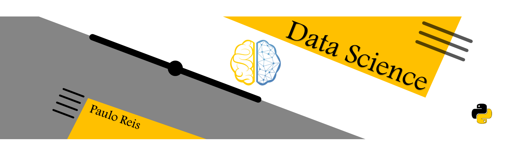

 

  

# Paulo Reis
*Futuro Cientista de Dados*

Estou em uma jornada tentando aprender todo tipo de técnica para torturar os dados até eles confessarem hehe.
E como iniciante, quero compartilhar alguns projetos que me ajudaram a praticar e aprender novos conhecimentos.

> "_A ideia no precipício era me jogar em uma quinzena de esforço para criar 5 projetinhos sobre cada tópico \[...] Quanta ingenuidade kkkk, levei bem mais que 15 dias \[...] O fato é: \[...] Se atalho fosse bom, ele seria o caminho._". Ciência de Dados — [Minha Jornada](https://sites.google.com/view/pauloreis/artigos/minha-jornada).

**Background:** loading...

**Links:**
* [Blog](https://sites.google.com/view/pauloreis/in%C3%ADcio-py)
* [LinkedIn](https://www.linkedin.com/in/paulo-reis-b1a2101b1/)

## Projetos:
[**Prevendo Preços de Apartamentos de Recife.**](https://github.com/pauloreis-ds/Projetos/tree/master/Previs%C3%A3o%20-%20Pre%C3%A7o%20Apartamentos%20Recife)

---

[Checklist para Projetos de Data Science](https://github.com/carlosfab/sigmoidal_ai/blob/master/notebooks/Checklist%20para%20Data%20Science.ipynb)
